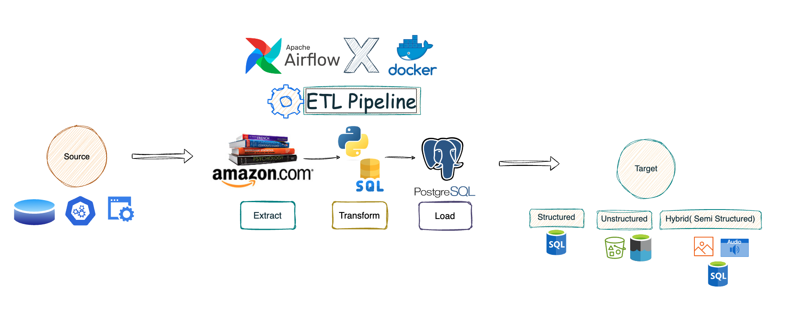

# **Amazon Books ETL Project**

This project uses Apache Airflow to fetch data from Amazon about books, store it in a PostgreSQL database, and perform subsequent data analysis or reporting.

---

## **Project Overview**
The project consists of:
- **Data Extraction**: Fetching books data from Amazon's web pages or an API.
- **Data Storage**: Storing the data in a PostgreSQL database (`books` table).
- **Workflow Orchestration**: Using Airflow to schedule and manage ETL workflows.

---

## **architecture**


# Create multiple directories
New-Item -Path './dags', './logs', './plugins', './config' -ItemType Directory

1. **Set Up PostgreSQL**
   - Navigate to the pgAdmin web interface: [http://localhost:5050/browser/](http://localhost:5050/browser/).
   - Create a **new server** with the following details:
     - **Server Name**: `ps_db`
     - **Username**: `airflow`
     - **Password**: `airflow`
     - **Host Name/Address**: Run the following command to retrieve the host's IP address:
       ```bash
       docker inspect <container_id>
       ```
       Copy the `IPAddress` value from the output for your PostgreSQL container.
   - Once connected, create a new database named `amazon_books`.

2. **Create the Airflow Connection**
   - Navigate to Airflow UI > Admin > Connections.
   - Add a connection with the following details:
     - **Conn Id:** `books_connection`
     - **Conn Type:** `Postgres`
     - **Host:** `<host-ip-from-docker>`
     - **Schema:** `amazon_books`
     - **Login:** `airflow`
     - **Password:** `airflow`
     - **Port:** `5432`

---

## **Workflow Explanation**

1. **DAG: `fetch_and_store_amazon_books`**
   - **Task 1**: `create_table`
     - Creates the `books` table in the PostgreSQL database.
   - **Task 2**: `fetch_books_data`
     - Scrapes or fetches book details (e.g., title, author, price, rating).
   - **Task 3**: `insert_books_data`
     - Inserts the fetched data into the `books` table.

2. **Table Schema**
   ```sql
   CREATE TABLE books (
       id SERIAL PRIMARY KEY,
       title TEXT NOT NULL,
       authors TEXT,
       price TEXT,
       rating TEXT
   );
   ```


## **Usage**

1. **Run the DAG**
   - In the Airflow UI, trigger the DAG `fetch_and_store_amazon_books`.

2. **Monitor Logs**
   - View logs in the Airflow UI to troubleshoot errors.

3. **Query the Database**
   - Access the stored data using any SQL client:
     ```sql
     SELECT * FROM books;
     ```

---


## **Contributors**
- [MEROUANE BENELABDY ](https://github.com/merouane-bn)

---

